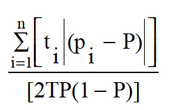
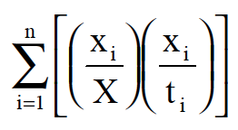
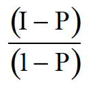
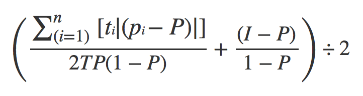

```{r setup, echo=FALSE, include=FALSE}
knitr::opts_chunk$set(error = TRUE)
source('analysis.R')
library(ggplot2)
```

## Metric Definition

The Metrics used for this analysis are Dissimilarity, Isolation, and Correlation. 

###Dissimilarity ###
<div style = 'width:130px'>


</div>

ti =  the total population of area i

pi = the proportion of area i's population that is minority

P = proportion of the metropolitan area's population that is minority

T = the total population


Dissimilarity is the most widely used measure of evenness, measuring the percentage of a group's population that would have to change residence for each neighborhood to have the same percentage of that group as the the metropolitan area overall. Smaller the value is, less segregation is spotted, and bigger the value is, more segregation is spotted. It captures how evenly minority populations are distributed.

Although the dissimilarity index are meant to give how segregated/integrated the given place is, it only shows how evenly distributed minorities are, meaning even if the given metropolitan area is segregated in general, it would still give smaller value, meaning the place is less segregated as long as the areas given are equally segregated. 


###Isolation ###
<div style = 'width:130px'>

</div>

xi = the minority population of area i

X = the total minority population

ti = total population of area i

Isolation is one of the basic measures of exposure with Interaction (Interaction = 1- Isolation). It reflects the probabilities that a minority person shares a unit area with a majority person or with another minority person, meaning that it calculates how much minority members are exposed only to one another. Higher the index, is more isolated minorities are in that origin. 

Although Isolation captures the isolation rate, it overlooks the cases where there are small minority population in general. For example, even if all the minorities in that metropolitan area are living in the same village, if the population of minority is small in general, it will still give lower Isolation rate since there are such a small percentage of minorities (xi/ti) in general

###Correlation ###
<div style = 'width:70px'>

</div>

I = Isolation index

P = proportion of the metropolitan area's population that is minority

Correlation is an adjustment of the isolation index to control for the asymmetry yields. Unlike Isolation by itself, it also takes proportion of the metropolitan area's population that is minority, and thereby making the measure of exposure more significant than does Isolation or Interaction by themselves. 


## Metric Comparison

```{r echo=FALSE}
print(df)
```

The table above is calculated indexes of Dissimilarity, Isolation, and Correlation by each city, and table below is summary of aggregated indexes of all 14 cities. The mean and medians were close to 50% for aggregated indexes of Dissimilarity and Isolation, whereas Correlation had lower mean& median value. 

According to Dissimilarity, Ok_city is the least segregated city among the 14 cities, and Milwaukee is the most segregated city. 
Ok_city is 3rd least Isolated city and Milwaukee is 3rd most isolated city according to the Isolation indexes. Milwaukee is still the most isolted city, and Ok_city is second least isolated city according to the Correlation index.

According to Isolation, Devner is the least isolated city whereas Baltimore is the most isolated city. Dever is still the least isolated city according to Correlation, and Baltimore is 3rd most isolated.

According to Correlation, Denver is the least isolated city, and Milwaukee is the most isoalted city. Correlation's minimum index's city was same as Isolation's, and maximum index's city was same as Dissimilarity's. 

```{r echo=FALSE}
print(agg.dataframe)
```

```{r echo=FALSE}
print(DvsI)
print(DvsCo)
print(IvsCo)
```
Three graphs above shows how Isolation, Dissimilarity, and Correlation correlate to each other. All of them have possitive relation with each other, meaning when one index increases, its is more likely for other index to increase as well. Isolation vs Dissimilarity didn't fit as well as other relationships, whereas Correlation vs Dissimilarity had high correlation with each other with scatterplots being not so far away from the best-fit-line indicated with blue line. The correlation between Correlation Index and Dissimilarity can show that the Milwaukee is the most segregated and Isolated city from given 14 cities.

```{r echo=FALSE}
print(boxG)
```
According to the box plot above, Dissimilarity has a outlier, Ok_city. If we omit Ok_city from the list, Denver is the least segregated city from 13 cities which is the least isolated city according to the correlation index. 

By these different tools of visualizations and analysis, Denver is the least segreggated city and Milwaukee is the most segregated city from given cities.

##Metric Proposal
<div style = 'width:300px'>

</div>


ti =  the total population of area i

pi = the proportion of area i's population that is minority

P = proportion of the metropolitan area's population that is minority

T = the total population

I = Isolation

This equation takes the mean of dissimilarity and correlation. From the analysis, there were clear relationship between Dissimilarity and Correlation, but they didn't fit exactly to each other. Dissimilarity doesn't really take Isolation into account, so I took the mean of both dissimilarity and correlation and created a new matric. This will take account of both eveness, isolation, and correlation. 


```{r echo=FALSE}
propo <- lapply(race.data, newMatric)
propo.df <- data.frame('City' = unlist(cityNames), 'Index' = unlist(propo))
print(propo.df[order(-propo.df$Index),])
par(las=2, mar=c(5,8,4,2))
propo.barplot <- barplot(propo.df$Index, horiz=TRUE, names.arg = propo.df$City)
```


